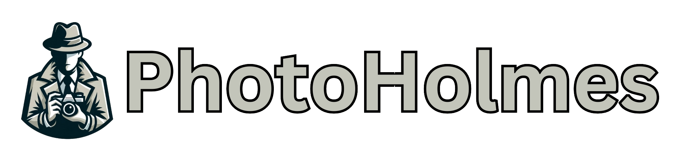

  

# <p style="text-align: center; font-size: 36; font-weight: bold">A python library for forgery detection in digital images</p>

## Introduction

PhotoHolmes is an open-source _python_ library designed to easily run and benchmark forgery detection methods on digital images. The library includes an implementation of popular and state-of-the-art methods, datasets and evaluation metrics, all of which easily integrate with their custom methods, datasets and metrics. The user can also evaluate a single image via the command-line interface (CLI) or a full method on a chosen dataset via the `Benchmark` class.

## Development setup

The Python requirements are `python >= 3.10`. Create a virtual enviroment, either with conda or with pip.
Activate the enviroment and install the library and required packages. For the latter, there are two options.

### Install: Benchmarking and library use

If you only wish to use the library as a user, for benchmarking or other uses, run:

``` bash
pip install -e .
```

> **Note:** `pip install photoholmes` will be later available in PyPI once the library is published.

> **Note:** not all method dependencies are included as a requirement. Some particularly big packages, like huggingface's transformers, which are use by only one method are excluded
> and need to be installed manually if the user wishes to use the method. When the user tries to use a method that is not installed, the library will raise an error poiting out how to solve the issue.

### Install: Develop

If you wish to develop on the library run:

``` bash
pip install -e .[dev]
```

## Benchmarking

One of the main features of the PhotoHolmes library is the capacity to easily benchmark a `method` over a `dataset`, evaluating on a set of `metrics`. This means one can evaluate existing and custom methods uniformly and fairly, simplifying the process of method comparison.

This can be invoked in a simple manner by creating an instance of the `Benchmark` class and calling the `run` method, in the following way:

```python
from photoholmes.benchmark import Benchmark

benchmark = Benchmark(output_folder="output/folder/path")

random_method_results = benchmark.run(method=method, dataset=dataset, metrics=metrics)
```

For the benchmark to run, `method`, `dataset` and `metrics` must be instances of PhotoHolmes' `Method`, `Dataset` and `MetricCollection` respectively. We provide ready implementations for common datasets and methods, which you can access from the factory, as shown in the following example.

```python
from photoholmes.methods.factory import MethodFactory, MethodRegistry
from photoholmes.datasets.factory import DatasetFactory, DatasetRegistry
from photohoolmes.metrics.factory import MetricsFactory, MetricsRegsitry

method, method_preprocessing = MethodFactory.load(MethodRegistry.IMPLEMENTED_METHOD)
dataset = DatasetFactory.load(
    DatasetRegistry.DATASET,
    dataset_path="dataset/directory/path",
    load=["image"],
    preprocessing_pipeline=method_preprocessing,
)
metrics = MetricFactory.load([MetricsRegistry.AUROC, MetricsRegistry.IOU])
```

However, if you have custom methods, datasets or metrics you wish to use for a benchmark, they can easily be integrated into this framework. A good example that shows different ways of implementing objects and integrating custom ones can be found in the [benchmarking a method notebook](notebooks/benchmarking_a_method.ipynb). There is also more detailed documentation and examples for each module in the respective [methods](src/photoholmes/methods/README.md), [datasets](src/photoholmes/datasets/README.md) and [metrics](src/photoholmes/metrics/README.md) READMEs.

> **Warning on MPS as a device:** We advise the user to be careful when running a method on `mps` as the `device`. The PhotoHolmes team found it produces different outputs (with respect to `cpu` or `cuda`) in some cases.

## `run` the Photolmes CLI

Benchmarking aside, PhotoHolmes makes it even quicker and more practical when it comes to evaluating implemented methods on single images. This can be done using the PhotoHolmes CLI with the command `run`, as follows:

```bash
photoholmes run zero --output-folder output/folder/path image/path
```

The CLI includes more useful commands, such as `download_weights` to easily download the weights of the implemented methods. Read the [CLI documentation](src/photoholmes/cli/README.md) for a better description on what it can do and how to use it.

## Contributing

If you integrate any method, dataset or metrics that are not included in PhotoHolmes, you are most welcome to contribute! You can follow more precise instructions in [CONTRIBUTING](CONTRIBUTING.md).

## License

PhotoHolmes integrates a variety of methods, some with different associated licences than others. All of these are available at their respective `src/photoholmes/methods/<METHOD>` folder. When a user utilizes code from a specific method, they are automatically subjected to the method's respective License.

This being said, the base [License](LICENSE) of this project is the Apache 2.0 License, but can change into a more restrictive License according to the methods used by the user. For instance, using the method TruFor or its code in any way implies the user accepts its respective License, which among other things, limits the use of this software to non-profit purposes, which is more restrictive than the aforementioned base License.
