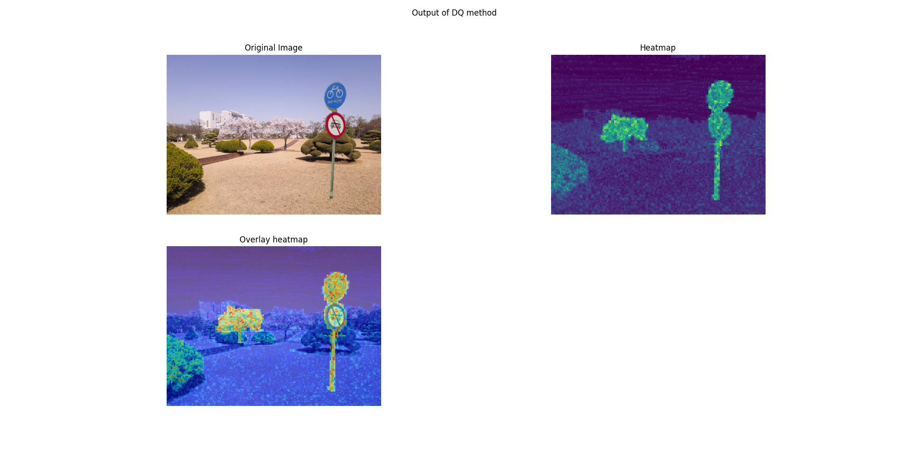

# Photoholmes' CLI

## Overview

This module defines a command-line interface with functionality to simplify setting up and runnning implemented methods. Once the library is installed, you can see the CLI options by running

```bash
photoholmes --help
```

Currently, we have implemented three commands:

1. **Run:** run one the methods included in the library with the default configurations.
2. **Download weights:** for those methods that use neural networks, a simple command has been included to download the weights from the original source, or in some cases a
version modified by the PhotoHolmes team.
3. **Adapt weights:** in some methods, the PhotoHolmes team has modify the original implemetation to remove unused weight layers from neural nets, so a script is provided
to make those adjustments to the original weights.

## Run

Most of the time, proposed method code only includes code for evalution and or training, but not a script for single image inference.
In an effort to make these methods more accesible we have included the `run` command in the cli that runs inference on a single image.
The CLI is built using the Typer package, allowing for quick and simple extensibilty.

If you run:

```bash
~$ photoholmes run --help
Usage: photoholmes run [OPTIONS] COMMAND [ARGS]...

  Run a method on an image.

Options:
  --help  Show this message and exit.

Commands:
  adaptive_cfa_net  Run the Adaptive CFA Net method.
  catnet            Run the CatNet method.
  dq                Run the DQ method.
  exif_as_language  Run the Exif As Language method.
  focal             Run the Focal method.
  noisesniffer      Run the Noisesniffer method.
  psccnet           Run the PSCCNet method.
  splicebuster      Run the Splicebuster method.
  trufor            Run the TruFor method.
  zero              Run the Zero method.
```

Under _Commands_ you will find the available methods for inference. Each method is it's 
own command so that they can have different arguments and options, but every command has
at least the following:

* **Arguments:**
  * IMAGE_PATH: path to the image you want to run the method on.
* **Options:**
  * output-folder: path to a folder where to save the output of the method. If no path
                     is provided then the outputs aren't saved.
  * overlay / no-overlay: if set, an extra image is included in the plot with the mask
                            or heatmap overlayed on the image.
  * show-plot / no-show-plot: whether to show results as a matplotlib plot.
  * device: for methods that use neural networks, specify the device you want to run
              on.

To see the different arguments each method has, you can simply run

``` bash
photoholmes run [METHOD NAME] --help
```

### Running a classic method

As an example, try running dq on an image with overlay and
saving outputs:

``` bash
photoholmes run dq [PATH_TO_IMAGE] --output-folder output/ --overlay
```

A plot like the following should appear



and you should see that a folder _output_ has been created, and inside you will find an image named `{image_name}_dq_heatmap.png`.

### Running a deep learning method

Methods that rely on neural nets add extra parameters to the command to set the paths
to the trained weights. If the paths aren't provided, we will look for them in the default `weights/` folder. If not found, an error will be raised prompting you to either provide the path or download the weights using the [download weights command](#download-weights).

These methods also include the `device` option, allowing you to make use of your compute resources. Keep in mind some of these methods take up quiet a lot of space in memory once loaded, especially if running on a big image (>2000x2000), so be sure you have enough resources available.
> So far, we have only tested it on cpu, cuda and mps (M1). In theory it should work on
> any device torch has a backend for, but due to a lack of testing we don't make that
> guarantee.

Let's run an example on CatNet.

``` bash
photoholmes download_weights catnet
photoholmes run catnet path/to/image --overlay --ouput-folder output
```

In the output folder, an image named `<image_name>_catnet_heatmap.png` should have
been created.

## Download weights

For those methods that rely on neural networks to detect forgeries, we have created a
command to easily download and set them up to be ready to use. Check out the command
by running:

```bash
photoholmes download_weights
```

The CLI expects one argument:

* **Method:** method you want to download the weights for. The method must be one of
the registered methods.

And has one optional parameter:

* **Weights Folder:** where you want to download the weights to. Keep in mind the command will create a folder `{weights_folder}/method` inside.

Try downloading the exif-as-language weights using:

``` bash
photholmes download_weights exif_as_language
```

This will create a folder `weights/` if it doesn't exist yet, inside it you will find the `exif_as_language` folder with the weights inside. If you want to download the weights to a custom folder, simply add the weights folder option:

``` bash
photoholmes download_weights exif_as_language --weights-folder custom_weights
```

## Adapt weights

For some methods, the PhotoHolmes team decided to remove or rename some layers when adding the methods to the library, so we provide the scripts to make those changes to
the original weights. We include this in case a new version or a re-train of the model is published, making adapting and running the method with the new weights a breeze.

Currently, we only include an adaptation for the _exif as language_ weights, where we remove some of the leftover clip layers. Check the command out by running:

``` bash
photoholmes adapt_weights --help
```
